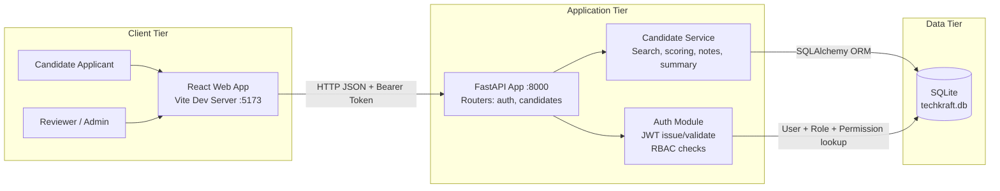

# TechKraft Recruitment Workspace (ATS)

An internal Application Tracking System (ATS) built with FastAPI (Python) on the backend and React (Vite + TypeScript) on the frontend. The application features role-based access control (RBAC), scoring matrices, AI profile summaries, and a modern, high-end SaaS dashboard.
---

## Technical Architecture
The following diagram represents the runtime layout of the TechKraft ATS system:



### Database Entity-Relationship (ER) Schema
The database relies on an SQL database design implementing a full RBAC matrix. The entity relationships are modeled as follows:

---
## Setup and Run Instructions
### Prerequisites
- Python 3.10+
- Node.js 18+ (npm or pnpm)
- Docker (Optional)
---
### Local Manual Start
#### 1. Setup Backend Server
Create your environmental config file first:
```bash
cp backend/.env.example backend/.env
```
Inside the `backend` directory, install packages and start the Uvicorn dev server:
```bash
cd backend
python -m venv .venv
source .venv/bin/activate  # On Windows: .venv\Scripts\activate
pip install -r requirements.txt
uvicorn app.main:app --reload --port 8000
```
The FastAPI documentation page will be available at `http://localhost:8000/docs`.
#### 2. Setup Frontend App
Inside the `frontend` directory, install packages and run the Vite client:
```bash
cd frontend
npm install
npm run dev
```
Open your browser at `http://localhost:5173`.
---
### Docker Compose Start
You can build and run both packages concurrently using the configured `docker-compose.yml`:
```bash
docker-compose up --build
```
*   **Backend**: `http://localhost:8000`
*   **Frontend**: `http://localhost:5173`
---
## Architecture Decision Records (ADR)
### ADR 01: FastAPI for API Backend Services
*   **Context**: The team required an efficient API gateway handling JSON serialization, input validation (Pydantic), and self-documenting routing schemas out-of-the-box.
*   **Decision**: Adopted **FastAPI** coupled with Uvicorn.
*   **Trade-off**: fastapi is a microframework. Unlike Django, it lacks built-in admin dashboards and native migration tooling (e.g. Alembic would need to be added manually). We accepted programmatic db creation on system startup as a simpler initial mechanism.
### ADR 02: SQLite Database with Database-Level Soft Deletion
*   **Context**: The platform needs a persistent datastore that is easy to package, deploy, and seed locally without database server setups.
*   **Decision**: Decided to use **SQLite** accessed through **SQLAlchemy ORM**. To protect recruitment compliance, hard deletion is banned: deleting candidates sets their status to `"archived"` or populates `deleted_at`.
*   **Trade-off**: SQLite is limited in concurrent write scenarios compared to PostgreSQL. However, for a single-reviewer internal ATS workflow, SQLite is lightweight and fast.
### ADR 03: JWT-based Token Authentication with Custom RBAC payload
*   **Context**: Candidate lists, scoring details, and internal notes are sensitive resources that require role restrictions (e.g. `Admin` vs `Reviewer`).
*   **Decision**: Implemented signed **JSON Web Tokens (JWT)**. The payload embeds roles and permission scopes.
*   **Trade-off**: Reverting active tokens prior to their expiry requires a database/Redis-backed blocklist. We chose stateless JWT authentication for development speed and simplicity.
---
## Debugging Signal: In-Memory Search Performance Bug
### Problematic Pattern
```python
# from a hypothetical service layer — what's wrong here?
def search_candidates(status: str, keyword: str, page: int, page_size: int):
    all_candidates = db.execute("SELECT * FROM candidates").fetchall()
    filtered = [c for c in all_candidates if c["status"] == status]
    # ... also filter by keyword in Python ...
    offset = (page - 1) * page_size
    return filtered[offset : offset + page_size]
```
### Why it Matters at Scale
1.  **Memory Exhaustion (Out of Memory - OOM)**: Fetching all candidate entries (`SELECT *`) into memory loading can crash the app instance when the DB expands to hundreds of thousands or millions of records.
2.  **High Network & CPU Overhead**: Deserializing thousands of SQLite/Postgres rows into Python dicts for every single paginated search request causes heavy network I/O and locks the CPU main thread.
3.  **Inefficient Pagination**: Pagination slicing in Python (`filtered[offset:offset+page_size]`) means we still process and load all records prior to the slice, making high page number queries increasingly slow.
### Correct Approach
The database should handle filtering, searching, and offset slicing through SQL execution using native database indexes:
```python
def search_candidates(status: str, keyword: str, page: int, page_size: int):
    offset = (page - 1) * page_size
    
    # Run parameterized filtering and database-level pagination
    query = """
        SELECT * FROM candidates
        WHERE status = :status
          AND deleted_at IS NULL
          AND (name LIKE :keyword OR email LIKE :keyword OR role_applied LIKE :keyword)
        LIMIT :limit OFFSET :offset
    """
    
    params = {
        "status": status,
        "keyword": f"%{keyword}%",
        "limit": page_size,
        "offset": offset
    }
    
    return db.execute(query, params).fetchall()
```
---
## Learning Reflection
For this revamp, we implemented customized password visibility state handlers and strict validation patterns mimicking the backend schemas completely without adding external utility packages. This keeps Vite build bundle sizes small. In the future, we would explore end-to-end integration testing using Playwright to automate verifying the dashboard interactions and responsive visual components.
---
## Example API Calls (cURL Commands)
### 1. Register a New Reviewer (Password must meet strict strength checks)
```bash
curl -X POST http://localhost:8000/auth/register \
  -H "Content-Type: application/json" \
  -d '{"email": "reviewer@company.com", "password": "SecurePassword123!"}'
```
### 2. Authenticate to Retrieve a Bearer JWT Token
```bash
curl -X POST http://localhost:8000/auth/token \
  -H "Content-Type: application/x-www-form-urlencoded" \
  -d "username=reviewer@company.com&password=SecurePassword123!"
```
### 3. Submit a Candidate Profile (Careers Portal)
```bash
curl -X POST http://localhost:8000/candidates/apply \
  -H "Content-Type: application/json" \
  -d '{
    "name": "Jane Smith",
    "email": "janesmith@example.com",
    "role_applied": "Backend Engineer",
    "skills": ["Python", "FastAPI", "PostgreSQL"]
  }'
```
### 4. Fetch Candidate List (Authorized — Replace `<TOKEN>` with your bearer token)
```bash
curl -X GET "http://localhost:8000/candidates?page=1&page_size=20" \
  -H "Authorization: Bearer <TOKEN>"
```
### 5. Record Candidate Evaluation Scorecard (Authorized)
```bash
curl -X POST "http://localhost:8000/candidates/<CANDIDATE_ID>/scores" \
  -H "Authorization: Bearer <TOKEN>" \
  -H "Content-Type: application/json" \
  -d '{
    "category": "Technical Skill",
    "score": 5,
    "note": "Exceeded expectations in Python API design principles."
  }'
```