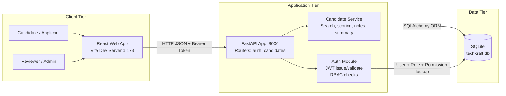
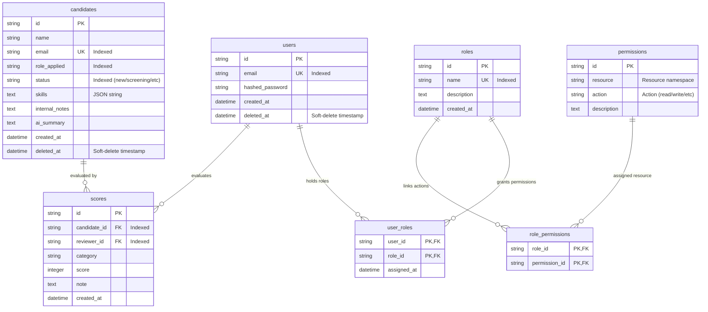

# TechKraft Recruitment Workspace — ATS

An internal **Applicant Tracking System (ATS)** built on a FastAPI (Python) backend and a React (Vite + TypeScript) frontend. The platform provides role-based access control (RBAC), structured scoring matrices, AI-generated candidate profile summaries, and a modern SaaS-grade reviewer dashboard.

---

## Table of Contents

- [Technical Architecture](#technical-architecture)
- [Database Schema](#database-entity-relationship-schema)
- [Setup & Run Instructions](#setup--run-instructions)
- [Architecture Decision Records](#architecture-decision-records)
- [Performance Engineering Note](#performance-engineering-note-in-memory-search-anti-pattern)
- [Known Limitations & Future Work](#known-limitations--future-work)
- [API Reference](#api-reference-curl-examples)

---

## Technical Architecture

The diagram below represents the runtime layout of the TechKraft ATS:



---

## Database Entity-Relationship Schema

The database implements a full RBAC permission matrix. Soft-deletion is enforced at the data tier — no candidate or user record is ever permanently removed.



---

## Setup & Run Instructions

### Prerequisites

| Dependency | Version |
|---|---|
| Python | 3.10+ |
| Node.js | 18+ (npm or pnpm) |
| Docker | Optional — for containerised startup |

---

### Option A — Local Manual Start

#### 1. Backend

Copy the example environment file and fill in required values:

```bash
cp .env.example backend/.env
```

Create and activate a virtual environment, install dependencies, and start the Uvicorn dev server:

```bash
cd backend
python -m venv .venv
source .venv/bin/activate        # Windows: .venv\Scripts\activate
pip install -r requirements.txt
uvicorn app.main:app --reload --port 8000
```

Interactive API documentation is available at `http://localhost:8000/docs`.

#### 2. Frontend

```bash
cd frontend
npm install
npm run dev
```

Open `http://localhost:5173` in your browser.

---

### Option B — Docker Compose

Build and start both services in one command:

```bash
docker-compose up --build
```

| Service | URL |
|---|---|
| Backend (FastAPI) | `http://localhost:8000` |
| Frontend (Vite) | `http://localhost:5173` |

---

## Architecture Decision Records

### ADR-01 — FastAPI for API Backend Services

**Context:** The team needed an efficient API gateway with native JSON serialisation, Pydantic-based input validation, and auto-generated OpenAPI documentation — without a heavy framework.

**Decision:** Adopted **FastAPI** with Uvicorn as the ASGI server.

**Consequences and trade-offs:**

- FastAPI is a microframework. Unlike Django, it ships without a built-in admin interface, CLI migration tooling (Alembic), or an ORM by default. We accepted programmatic schema creation at startup as a pragmatic early-stage approach, with the acknowledged need to introduce Alembic for production parity.
- There is no background task queue (e.g. Celery or ARQ). AI summary generation is currently synchronous and will block the request thread on slow model responses. A task queue should be introduced before scaling beyond a handful of concurrent users.

---

### ADR-02 — SQLite with Application-Level Soft Deletion

**Context:** The platform requires a persistent datastore that is trivially deployable and seedable locally without a standalone database server.

**Decision:** **SQLite** accessed via **SQLAlchemy ORM**. To meet basic recruitment-compliance requirements, hard deletion is disabled: removing a candidate sets their `status` to `"archived"` and populates `deleted_at`; removing a user sets `deleted_at` only.

**Consequences and trade-offs:**

- SQLite serialises all writes and is unsuitable for high-concurrency workloads. For multi-reviewer teams or production deployments, migrating to PostgreSQL (a one-driver swap with SQLAlchemy) is strongly recommended.
- `deleted_at IS NULL` filters must be applied consistently at the query layer. Any query that omits this guard will silently surface archived records — this is a recurring source of data-integrity bugs and should be enforced via a SQLAlchemy query filter helper or a view-level abstraction.
- There is no migration history. Schema changes require either a full database rebuild or manual `ALTER TABLE` statements. Alembic should be wired in before the first schema-breaking change.

---

### ADR-03 — Stateless JWT Authentication with Embedded RBAC Claims

**Context:** Candidate lists, scoring details, and internal notes are sensitive resources requiring role-level access restrictions (`Admin` vs `Reviewer`).

**Decision:** Signed **JSON Web Tokens (JWT)** with role and permission scopes embedded in the payload. Verification is performed on every request without a database round-trip.

**Consequences and trade-offs:**

- **No token revocation.** Revoking an active token before expiry requires a database- or Redis-backed blocklist. Stateless JWT was chosen for development speed; before going to production, a blocklist or short-lived access token + refresh token rotation strategy must be implemented.
- **No refresh token table.** Refresh tokens were deliberately excluded from the initial implementation due to time constraints. Currently, users must re-authenticate once their access token expires. A `refresh_tokens` table (storing hashed token, `user_id`, `expires_at`, `revoked_at`, and device metadata) should be introduced to support seamless session continuity and per-device revocation.
- **Role changes are not reflected immediately.** Because roles are baked into the JWT at issuance, demoting or removing a user's role does not take effect until their current token expires. Reducing token TTL (e.g. 15 minutes) mitigates this window; a blocklist eliminates it entirely.

---

### ADR-04 — Frontend Validation Without External Utility Libraries

**Context:** Keeping the Vite bundle size minimal and avoiding third-party form-library dependencies.

**Decision:** Custom password visibility state handlers and input validation patterns written to mirror backend Pydantic schemas exactly, without introducing libraries such as `react-hook-form`, `zod`, or `yup`.

**Consequences and trade-offs:**

- Validation logic is duplicated between frontend and backend. Any schema change must be applied in both places manually — a maintenance risk. Consider auto-generating TypeScript types from the OpenAPI spec (e.g. using `openapi-typescript`) to keep schemas in sync.
- No form-state management library means complex multi-step forms will require bespoke state orchestration. This approach scales poorly beyond the current single-page forms.

---

## Performance Engineering Note — In-Memory Search Anti-Pattern

### The Problem

The following pattern is a critical performance bug at scale:

**Why this fails at scale:**

1. **Memory exhaustion (OOM):** Fetching every row into Python heap on each paginated request will crash the process once the candidate table grows to hundreds of thousands of records.
2. **CPU contention:** Deserialising large result sets into Python dicts is CPU-bound and will block the async event loop, degrading latency for all concurrent requests.
3. **Pagination is effectively O(n):** The slice `filtered[offset:offset+page_size]` runs after the entire table is loaded and filtered — page 500 is just as expensive to compute as page 1, but wastes even more work.

### The Correct Approach — Push Filtering and Pagination to the Database

```python
# CORRECT — database handles filtering, searching, and pagination
def search_candidates(
    db: Session,
    status: str,
    keyword: str,
    page: int,
    page_size: int,
) -> list[dict]:
    """
    Returns a paginated, filtered candidate list.
    All work is performed inside the database using native indexes.
    Only the requested page is transferred over the wire.
    """
    if page < 1 or page_size < 1:
        raise ValueError("page and page_size must be positive integers")

    offset = (page - 1) * page_size
    keyword_param = f"%{keyword}%"

    query = text("""
        SELECT
            id, name, email, role_applied, status, created_at
        FROM candidates
        WHERE deleted_at IS NULL
          AND status        = :status
          AND (
                name         LIKE :keyword
             OR email        LIKE :keyword
             OR role_applied LIKE :keyword
          )
        ORDER BY created_at DESC
        LIMIT  :limit
        OFFSET :offset
    """)

    rows = db.execute(query, {
        "status":  status,
        "keyword": keyword_param,
        "limit":   page_size,
        "offset":  offset,
    }).mappings().all()

    return [dict(row) for row in rows]
```

**Key improvements:**

- Only the requested page is fetched from the database — memory usage is constant regardless of table size.
- `WHERE` clause predicates exploit the existing `status`, `name`, `email`, and `role_applied` indexes.
- `deleted_at IS NULL` is enforced at the query level, preventing soft-deleted records from leaking into results.
- `ORDER BY created_at DESC` ensures deterministic pagination — without an explicit `ORDER BY`, paginated results are undefined under SQLite's query planner.
- Keyword is bound as a parameterised value, preventing SQL injection.

> **Production note:** For full-text search across large datasets, consider SQLite's FTS5 virtual table or migrate to PostgreSQL with `pg_trgm` + GIN indexes, which support `ILIKE` queries with sub-millisecond latency at millions of rows.

---

## Known Limitations & Future Work

| Area | Current State | Recommended Path Forward |
|---|---|---|
| Token revocation | No blocklist; tokens are valid until expiry | Introduce a Redis-backed or DB-backed JWT blocklist |
| Refresh tokens | Not implemented | Add a `refresh_tokens` table with rotation and per-device revocation |
| Database migrations | Programmatic schema creation only | Wire in Alembic; version all schema changes |
| Concurrency | SQLite serialises writes | Migrate to PostgreSQL for multi-reviewer production workloads |
| Background tasks | AI summaries are synchronous | Introduce Celery or ARQ with a Redis broker |
| Schema sync | Frontend validation duplicates backend schemas | Generate TypeScript types from the OpenAPI spec |
| Testing | Automated pytest suite implemented in backend/tests | Add Playwright for E2E dashboard testing |
| Soft-delete safety | `deleted_at IS NULL` must be applied manually | Enforce via a SQLAlchemy base query filter or database view |

---

## API Reference (cURL Examples)

### 1. Register a Reviewer

A standard user registration endpoint.

```bash
curl -X POST http://localhost:8000/auth/register \
  -H "Content-Type: application/json" \
  -d '{
    "email": "reviewer@company.com",
    "password": "SecurePassword123!"
  }'
```

### 2. Authenticate and Retrieve a Bearer Token

```bash
curl -X POST http://localhost:8000/auth/login \
  -H "Content-Type: application/x-www-form-urlencoded" \
  -d "username=reviewer@company.com&password=SecurePassword123!"
```

Store the returned `access_token` value — pass it as a `Bearer` token in all subsequent authenticated requests.

### 3. Submit a Candidate Application (Public)

```bash
curl -X POST http://localhost:8000/candidates/apply \
  -H "Content-Type: application/json" \
  -d '{
    "name": "Jane Smith",
    "email": "janesmith@example.com",
    "role_applied": "Backend Engineer",
    "skills": ["Python", "FastAPI", "PostgreSQL"]
  }'
```

### 4. Fetch Paginated Candidate List (Authenticated)

Replace `<TOKEN>` with the `access_token` value from Step 2.

```bash
curl -X GET "http://localhost:8000/candidates?page=1&page_size=20" \
  -H "Authorization: Bearer <TOKEN>"
```

### 5. Submit a Candidate Evaluation Score (Authenticated)

Replace `<TOKEN>` and `<CANDIDATE_ID>` with appropriate values.

```bash
curl -X POST "http://localhost:8000/candidates/<CANDIDATE_ID>/scores" \
  -H "Authorization: Bearer <TOKEN>" \
  -H "Content-Type: application/json" \
  -d '{
    "category": "Technical Skill",
    "score": 5,
    "note": "Exceeded expectations in Python API design principles."
  }'
```

---

## Learning Reflection

This project was a great opportunity to implement stateless, claim-embedded role-based access control (RBAC) in FastAPI and map it directly to frontend visibility handlers without relying on heavy external libraries. Given more time, we would explore integrating Alembic for formal SQL schema migrations and set up Redis to support token revocation lists and async Celery background tasks for the simulated AI LLM summary endpoint, ensuring the API is fully ready to scale.